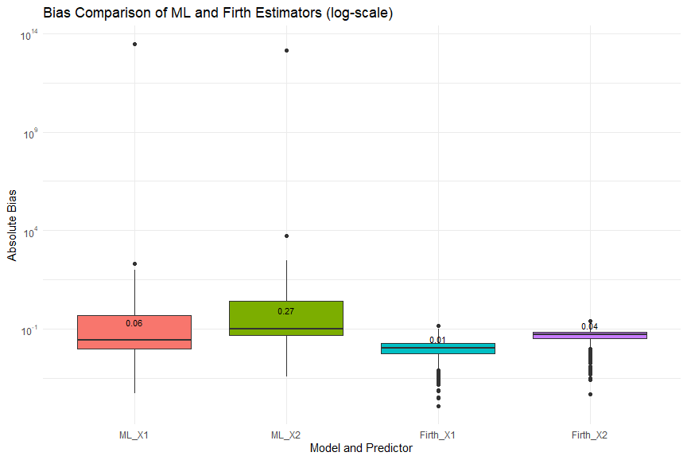
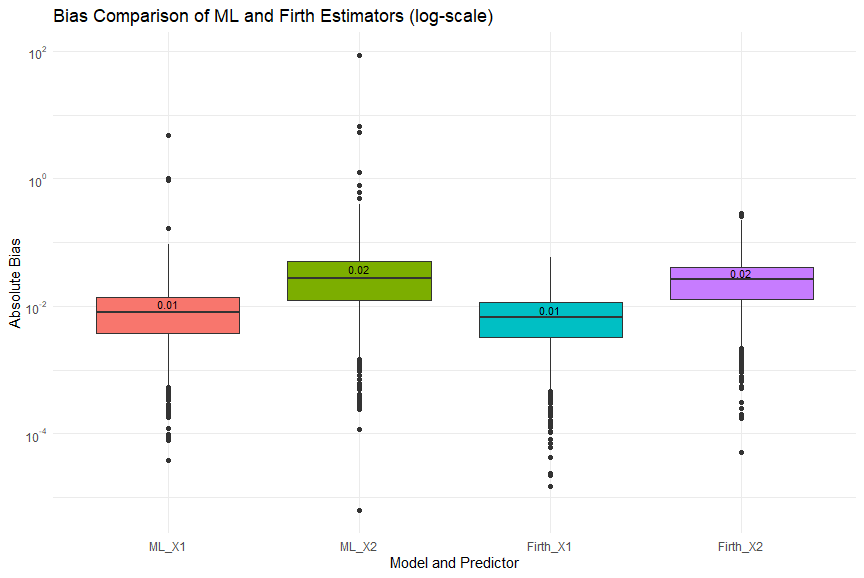

```{r setup, include=FALSE}
knitr::opts_chunk$set(echo = FALSE)
```

## Outline

\begin{enumerate}
\item Motivation
\item Firth's method - general case
\item Basic example
\item Firth's method - GLM case
\item Real data example
\end{enumerate}

## Refresher

$\text{Bias}(\hat \theta) = \mathbb{E}[\hat \theta] - \theta$  

Estimator is biased if it consistently overestimates or underestimates the parameter it is trying to estimate.  

&nbsp;

$\hat \theta_{MLE} = \text{arg max} L(\theta ; y_1,...,y_n)$  

Common method for estimating parameters in many statistical models, including linear regression, logistic regression, and many others.

## Motivation

- MLEs are consistent and asymptotically unbiased, but there is still a shrinking bias term.

- 1D case:

\[U(\hat\theta) = U(\theta) + U'(c(\hat\theta))(\hat\theta - \theta)\]
\[\Rightarrow \mathbb E U'(c(\hat\theta))(\hat\theta - \theta) = 0.\]

- If \(U'\) is not constant, then \(\hat\theta\) is certainly biased.

## Notation

\[\theta = \begin{pmatrix} \theta^1 \\ \vdots \\ \theta^p \end{pmatrix} \in \Omega\]

\[U_r(\theta) = \frac{\partial l(\theta)}{\partial \theta^r} \quad \quad U_{rs}(\theta) = \frac{\partial^2 l(\theta)}{\partial \theta^r \partial \theta^s}\]

\[\kappa_{r,s} = \frac{1}{n}\mathbb E U_rU_s \quad \quad \kappa_{rs} = \frac{1}{n}\mathbb E U_{rs}\]  

\[\kappa_{r,s,t} = \frac{1}{n}\mathbb E U_rU_sU_t \quad \quad \kappa_{r,st} = \frac{1}{n}\mathbb E U_rU_{st}\]

## Motivation

- The first term in the bias of \(\hat\theta\) has been studied.

$$
\begin{align*}
\mathbb E(\hat{\theta}^r - \theta^r) &= -\frac{\kappa^{r,s}\kappa^{t,u}(\kappa_{s,t,u} + \kappa_{s,tu})}{2n} + O\left(\frac{1}{n^{\frac{3}{2}}}\right) \\
&= \frac{1}{n}b_1^r(\theta) + O\left(\frac{1}{n^{\frac{3}{2}}}\right).
\end{align*}
$$

## Motivation

Example: Fit a GLM to data generated by the following model.

\[Y \sim Exp(\lambda)\]
\[\log(\mu) = \log(\frac{1}{\lambda}) = 8 + 5x\]

Predictor values \(x_i\) are predetermined, while \(Y_i\) is repeatedly simulated at \(x_i\) 10000 times.

## Motivation

```{r, warning = FALSE}
set.seed(20230320)

b0 <- 8
b1 <- 5
n <- 10
x <- runif(n, -10, 10)

trials <- 10000
# First row is b0, second row is b1, third row is dispersion (1/nu)
estims <- matrix(double(trials*3), nrow = 3)

for (i in 1:trials) {
  y <- rexp(n, rate = exp(-(b0 + b1*x)))
  mod <- glm(y ~ x, family = Gamma(link = "log"))
  estims[c(1,2),i] <- mod$coefficients
  estims[3,i] <- summary(mod)$dispersion
}

hist(estims[1,], main = "Empirical distribution of beta0 hat",
     xlab = "beta0 hat")
abline(v = b0, col = "blue", lwd = 3)
abline(v = mean(estims[1,]), col = "darkgreen", lwd = 3)
legend("topleft", legend = c("True b0", "Empirical mean"),
       col = c("blue", "darkgreen"), lwd = c(3,3))
```


## Motivation

```{r}
hist(estims[2,], main = "Empirical distribution of beta1 hat",
     xlab = "beta1 hat")
abline(v = b1, col = "blue", lwd = 3)
abline(v = mean(estims[2,]), col = "darkgreen", lwd = 3)
legend("topleft", legend = c("True b1", "Empirical mean"),
       col = c("blue", "darkgreen"), lwd = c(3,3))
```


## Firth's method

- Reduce the bias by using an adjusted score function.

\[U^*(\theta) = U(\theta) + A(\theta), A: \Omega \to \mathbb R^p\]

- Root is \(\theta^*\).

## Firth's method

- One can derive the bias of \(\theta^*\) when estimating \(\theta\)

\begin{align*}
\mathbb E((\theta^*)^r - \theta^r) &= -\frac{\kappa^{r,s}(\frac{1}{2}\kappa^{t,u}(\kappa_{s,t,u} + \kappa_{s,tu}) + \mathbb E  A^s(\theta))}{n} + O\left(\frac{1}{n^{\frac{3}{2}}}\right) \\
&= \frac{b_1^r(\theta) + \kappa^{r,s}\mathbb E A^s(\theta)}{n} + O\left(\frac{1}{n^{\frac{3}{2}}}\right).
\end{align*}

## Firth's method

- Suppose that:

\begin{align*}
&b_1^r(\theta) + \kappa^{r,s}\mathbb E A^s(\theta) + O\left(\frac{1}{\sqrt{n}}\right) = 0 \\
&\Leftrightarrow \mathbb E A^r(\theta) = -\kappa_{r,s}b_1^s(\theta) + O\left(\frac{1}{\sqrt{n}}\right) \\
&\Leftrightarrow \mathbb E A(\theta) = -\frac{1}{n}\mathcal I(\theta)b_1(\theta) + O\left(\frac{1}{\sqrt{n}}\right)
\end{align*}

- Then the first term of the bias is gone.

## Firth's method

- Firth (1993) suggests

\[A^{(O)}(\theta) = -\frac{1}{n}I(\theta)b_1(\theta),\]
or
\[A^{(E)}(\theta) = -\frac{1}{n}\mathcal I(\theta)b_1(\theta).\]

- The first one leads to more efficient (i.e. less variance) estimators.

- If the model uses an exponential family and \(\theta\) is the canonical parameter, then \(A^{(O)} = A^{(E)}\).

## Basic example

Let \(Y_1,...,Y_n \sim Exp(\lambda)\). Use Firth's method to reduce the bias of the MLE of \(\lambda\).

- We have \(l(\lambda) = n\log \lambda - \lambda\sum_{i=1}^n Y_i\), so:
\[U(\lambda) = \frac{n}{\lambda} - \sum_{i=1}^n Y_i.\]

- We can compute \(A^{(O)}(\lambda) = A^{(E)}(\lambda) = -\frac{1}{\lambda}\) (see work on board).

- Then
\[U^*(\lambda) = \frac{n-1}{\lambda} - \sum_{i=1}^n Y_i\]
and
\[\lambda^* = \frac{n-1}{\sum_{i=1}^n Y_i}.\]

## Basic example

```{r}
set.seed(20230328)

trials <- 10000
n <- 50
lambda <- 7

mle <- double(trials)
firth <- double(trials)

for (i in 1:trials) {
  y <- rexp(n, lambda)
  mle[i] <- 1/mean(y)
  firth[i] <- (n-1)/sum(y)
}

hist(firth, col = rgb(red = 0, green = 0, blue = 1, alpha = 0.5))
hist(mle, add = T, col = rgb(red = 0, green = 1, blue = 0, alpha = 0.5))
abline(v=mean(mle), col = "green", lwd = 2)
abline(v=mean(firth), col = "blue", lwd = 2)
abline(v=lambda, col = "red", lwd = 2)
legend("topright", legend = c("Firth", "MLE"), col = c("blue", "green"), pch = c(15,15))
```
## Application: Firth's method in logistic regression

First, let's generate some data based on the following distributions:  

&nbsp;

$\beta = (0.5, -0.01, 0.1)$  
$\eta = \beta_0 + \beta_1 X_1 + \beta_2 X_2$  

&nbsp;

$X_1 \sim U(1, 150)$  
$X_2 \sim U(0.5, 100)$  
$Y \sim Binom(n, \frac{\exp(\eta)}{1+\exp(\eta)})$

## Application (cont'd)

Now we fit a binomial GLM with logit link, as well as a logistic regression model using the R package **logistf**.  

&nbsp;

`glm_model <- glm(Y ~ X1 + X2, family = binomial(link = "logit"), data = sim_data)`  

&nbsp;

`firth_model <- logistf(Y ~ X1 + X2, data = sim_data)`  

&nbsp;

We then store the coefficients for each model, and repeat this experiment *n* times. 

## Application (cont'd) *n = 25*



## Application (cont'd) *n = 100*



## Firth for GLM's in literature

Kosmidis, I., Kenne Pagui, E. C., & Sartori, N. (2020). **Mean and median bias reduction in generalized linear models.**  

&nbsp;

GLMs with exponential family distributions with dispersion parameter $\varphi$ and coefficients $\beta$.  

&nbsp;

Section 2.3 proposes an algorithm to solve Firth's modified score equations:  
&nbsp; 

$\beta^{(j+1)} \leftarrow \beta^{(j)} + \{ i_{\beta \beta}^{(j)}\}^{-1} s_\beta^{(j)} - b_\beta^{(j)}$  
$\phi^{(j+1)} \leftarrow \phi^{(j)} + \{ i_{\phi \phi}^{(j)}\}^{-1} s_\phi^{(j)} - b_\phi^{(j)}$
